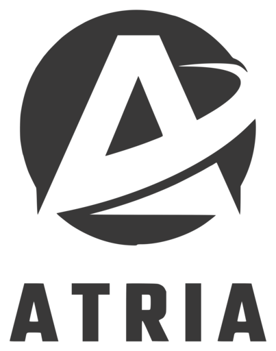

<picture>
  <source media="(prefers-color-scheme: dark)" srcset="brand/png/atria-lockup-light-512.png">
  
</picture>

# ATRIA

Régulation de la santé physique et mentale d'un équipage interstellaire.

Workshop National EPSI B3 2026 — *Horizon 2080*, pilier 1 : HumanTech & HealthTech spatiales.
Alexandre, Melih et Maxime.

## Le problème

Sur un vaisseau coupé de la Terre pendant des décennies, le système de survie le plus fragile
n'est pas le recycleur d'air : c'est l'équipage lui-même. Le vaisseau surveille son oxygène,
son énergie et son eau avec des capteurs, des alarmes et de la redondance. Il surveille ses
humains avec un questionnaire.

ATRIA traite l'équipage pour ce qu'il est, un système de survie critique qui a besoin de
monitoring continu, de régulation active et de tolérance aux pannes.

## Ce que fait le système

ATRIA maintient un état physiologique par membre d'équipage, alimenté par des capteurs réels,
et en déduit une **capacité cognitive** entre 0 et 1. Chaque poste du vaisseau exige un seuil
minimal. Le régulateur alloue postes, repos et créneaux sociaux sous contraintes de santé
dures — et il a le droit de refuser un ordre qui mettrait un membre d'équipage ou la mission
en danger.

Quatre commandes vocales, en français, entièrement hors ligne :

| Commande | Effet |
|---|---|
| `état de <nom>` | état d'un membre, filtré selon le badge présenté |
| `qui peut tenir le poste <poste>` | liste classée des aptes, avec les motifs |
| `affecte <nom> à <poste>` | validé, ou refusé avec motif et alternative |
| `situation` | synthèse : alertes, compartiments, indisponibilités |

Deux niveaux d'accès, résolus physiquement par badge NFC : le porte-clés donne à un membre
d'équipage l'accès à ses propres données, la carte donne au capitaine une vue globale — sur
laquelle aucune donnée médicale n'apparaît.

## Dashboard de bord

Le Pi sert un tableau de bord sur son propre réseau, en cinq onglets. On y entre en badgeant
le terminal physique : sans badge présenté, il n'y a qu'un écran de verrouillage, et la
session se referme d'elle-même au bout de trois minutes.

| Onglet | Contenu |
|---|---|
| Bord | synthèse, alertes, prévisions par régression, atmosphère en direct |
| Vaisseau | plan cliquable, puis atmosphère et occupants de chaque compartiment |
| Équipage | liste triée par capacité, puis fiche complète avec courbes sur 24 h |
| Journal | toutes les décisions, refus et dérogations, filtrables par type |
| Console | questions en langage naturel, sept outils tous en lecture seule |

Ce que voit le capitaine et ce que voit un membre d'équipage diffèrent. Le capitaine a la vue
globale et les postes, jamais une donnée physiologique. Le porte-clés ouvre le détail médical,
mais seulement à celui qui l'a présenté, et chaque consultation est écrite au journal.

Les courbes sont dessinées à la main en SVG, sans bibliothèque : tout doit fonctionner sans
réseau, donc rien n'est chargé depuis un CDN.

## Contrainte d'architecture

**Le système livré tourne intégralement sur la carte.** Le Raspberry Pi 5 porte le régulateur,
le modèle entraîné, la base de données, la synthèse et la reconnaissance vocale. Les machines
de développement servent à écrire le code et à entraîner le modèle, elles ne font pas partie
du vaisseau.

Aucune connexion Internet n'est requise à l'exécution. C'est la contrainte centrale du sujet,
et c'est aussi ce qui rend la démonstration vérifiable : on débranche le réseau, tout continue.

## Identité

Charte complète : [`brand/charte.html`](brand/charte.html), et son rendu imprimable dans
[`pdf/ATRIA-charte.pdf`](pdf/ATRIA-charte.pdf).

Le gris de marque `#393838` est le palier 700 d'une échelle de douze neutres calculée en
teinte 0, saturation 2 %. Quatre couleurs d'état s'y ajoutent, **reprises des conventions des
moniteurs patient** — vert nominal, ambre attention, rouge critique — chacune déclinée pour
fond clair et fond sombre, les huit validées en contraste WCAG AA.

| | Police | Rôle |
|---|---|---|
| Display | **Teko** | nom, titres, grandes valeurs — jamais sous 18 px |
| Interface | **Inter** | texte courant, libellés |
| Données | **Martian Mono** | valeurs numériques uniquement, pour l'alignement en colonne |

Les SVG sont en `currentColor` : un seul fichier sert sur fond clair, sur fond sombre et en
couleur d'alerte. La marque complète se lit jusqu'à 32 pixels ; en dessous, utiliser la
variante compacte `atria-mark-small.svg`.

```
brand/svg/          marque, mot, verrou, variante compacte
brand/png/          30 déclinaisons transparentes, 32 à 512 px
brand/fonts/        Teko, Inter, Martian Mono en TTF
brand/tokens.css    variables CSS, thème clair et sombre
brand/tokens.json   même palette, pour les outils non-web
```

## Organisation du dépôt

```
docs/         documentation technique
firmware/     sketches Arduino (Mega ADK)
pi/           services Python (Raspberry Pi 5)
brand/        identité visuelle et jetons de design
systemd/      unités de service
config/       cartographie matérielle et identifiants
sujet/        énoncé officiel du workshop
```

## Démarrage

Le schéma du montage, ce qui est relié à quoi et ce qui reste à ajouter, est dans
[`docs/montage.md`](docs/montage.md). L'inventaire complet, le brochage de chaque capteur et
son état de validation sont dans [`docs/materiel.md`](docs/materiel.md).

Pour reconstruire le Raspberry Pi depuis une carte SD vierge, suivre
[`docs/installation-pi.md`](docs/installation-pi.md).

Les écueils rencontrés pendant le montage, et leurs solutions, sont consignés dans
[`docs/pieges.md`](docs/pieges.md). À lire avant de rebrancher quoi que ce soit.

## Générer un PDF

Les documents sont écrits en HTML et rendus par Chrome en mode headless, ce qui donne un PDF
typographié avec les polices de la charte :

```bash
"/Applications/Google Chrome.app/Contents/MacOS/Google Chrome" \
  --headless --disable-gpu --virtual-time-budget=8000 \
  --run-all-compositor-stages-before-draw --no-pdf-header-footer \
  --print-to-pdf="$PWD/pdf/sortie.pdf" "file://$PWD/chemin/document.html"
```
