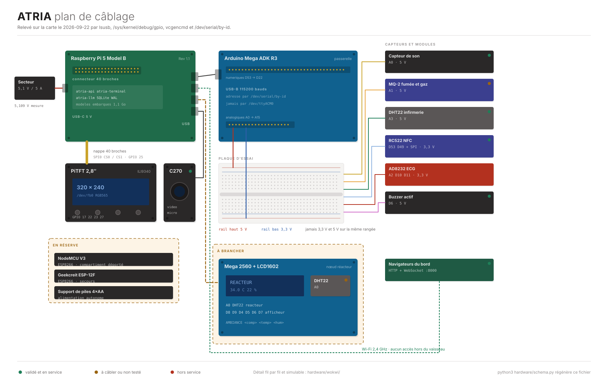
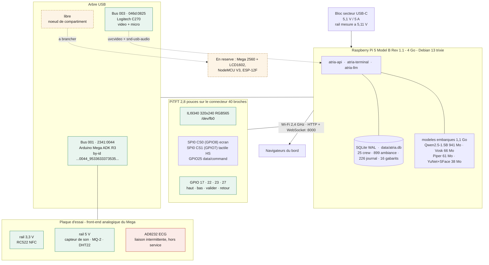
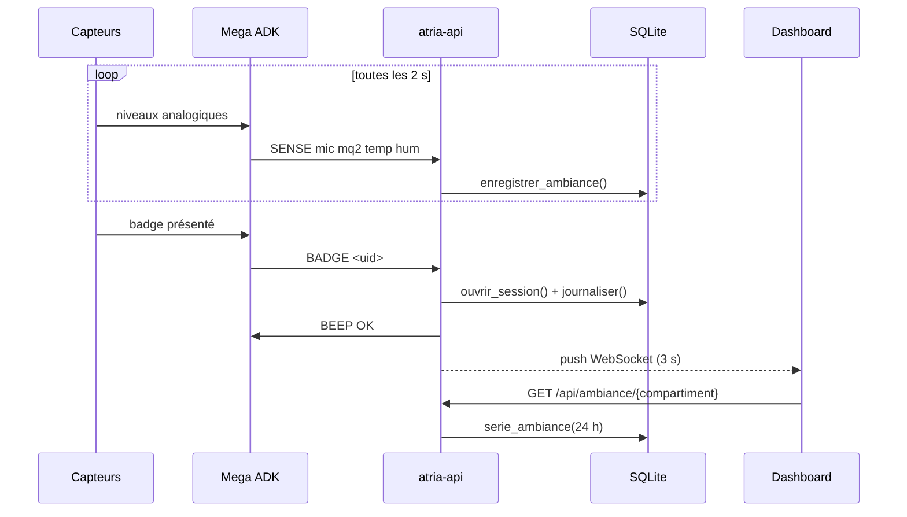
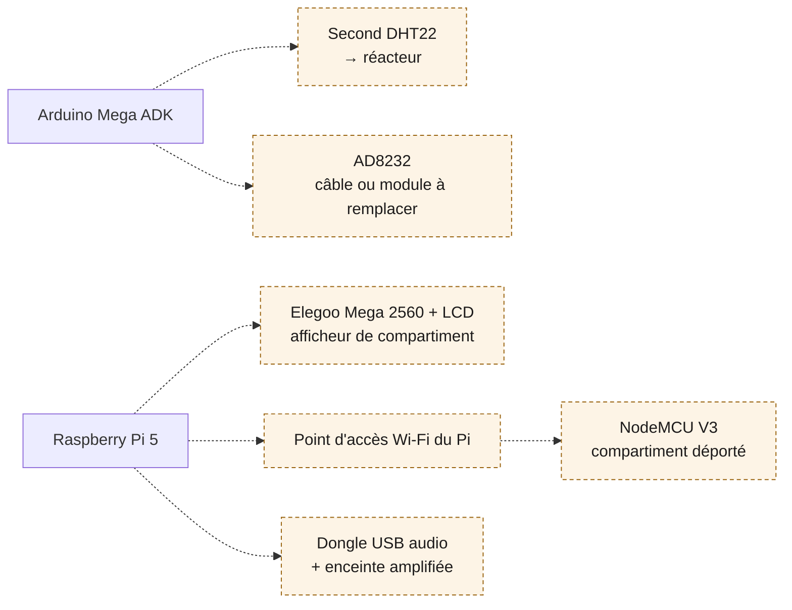

# Montage

Vue d'ensemble du vaisseau tel qu'il est câblé aujourd'hui. Le brochage détaillé, les tensions
et l'état de validation de chaque composant sont dans [`materiel.md`](materiel.md) ; ce
document sert à voir d'un coup d'œil ce qui est relié à quoi.

Ce plan est généré par [`hardware/schema.py`](../hardware/schema.py), un script plutôt
qu'un dessin fait à la main : la géométrie reste cohérente quand on déplace une carte ou
qu'on ajoute un capteur, et un diff reste lisible dans une pull request. Le relancer
régénère le SVG.

Wokwi ne propose aucun Raspberry Pi, seulement le Pico qui est un microcontrôleur : y
mettre un Pico à la place du Pi 5 serait faux. Le détail électrique fil par fil et
simulable des cartes Arduino reste donc dans [`hardware/wokwi/`](../hardware/wokwi/), et
ce plan porte la vue d'ensemble.

## Le montage actuel

Relevé sur la carte le 2026-09-22 par `lsusb -t`, `/sys/kernel/debug/gpio`, `vcgencmd` et
`/dev/serial/by-id`. Tout ce qui figure ici a été lu sur la machine, rien n'est supposé.

### Ce que le Pi expose vraiment

| Ressource | Etat mesure |
|---|---|
| `/dev/fb0` | `fb_ili9340`, 320x240, 16 bits |
| GPIO 7 et 8 | `spi0 CS1` et `CS0`, pris par le PiTFT |
| GPIO 25 | `dc`, data/command de l'ILI9340 |
| GPIO 17 22 23 27 | revendiques par `lgpio`, les quatre boutons |
| `/dev/i2c-1` | active, libre |
| Capture audio | carte 0, micro integre de la C270 |
| Sortie audio | **HDMI uniquement**, aucun peripherique USB audio |
| `/dev/ttyACM0` | Mega ADK, adresse par son chemin `by-id` |

Le connecteur 40 broches est entierement recouvert par le PiTFT et l'overlay de celui-ci
reserve SPI0. Aucun capteur ne peut y aller : tout passe par le Mega, en USB.

Le micro de la C270 change une conclusion prise plus tot dans le projet. La reconnaissance
vocale redevient possible sans achat. Il manque toujours une **sortie** audio : seul le
HDMI est disponible, donc pour que ATRIA parle il faut un dongle USB audio.

## Ce qui circule

Rien ne sort du vaisseau. Le dashboard est servi par le Pi, les modèles de voix sont sur sa
carte SD, et la base est un fichier local. Débrancher le réseau ne coupe que les navigateurs.

## La suite

Les composants ci-dessous sont en stock mais pas encore au montage. Ils viennent tous se
greffer sur des points déjà ouverts, sans toucher à ce qui fonctionne.

Le second DHT22 est le plus rentable : il fait passer le plan du vaisseau de un à deux
compartiments instrumentés, et il rend la comparaison entre deux atmosphères lisible sur les
courbes. Le NodeMCU dépend du point d'accès, qui dépend lui-même d'une liaison Ethernet pour
ne pas couper le SSH pendant la bascule.
