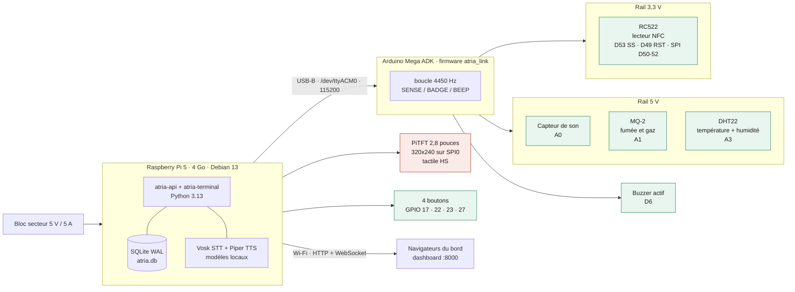
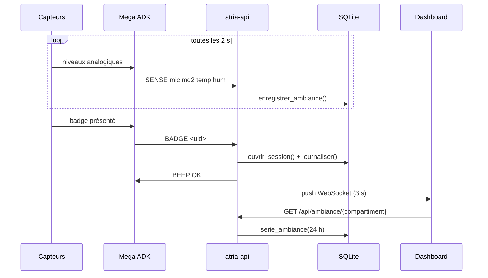
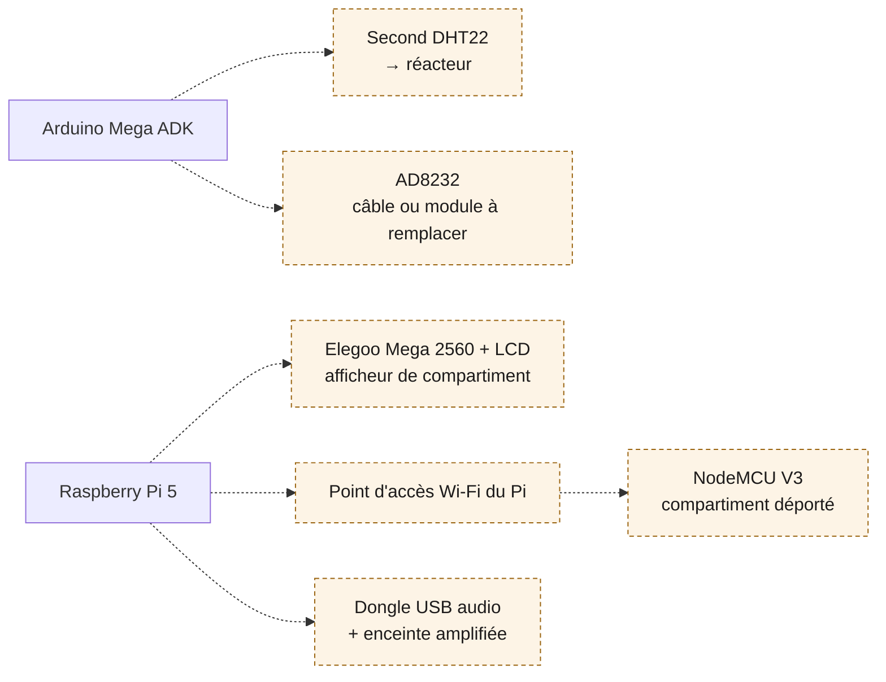

# Montage

Vue d'ensemble du vaisseau tel qu'il est câblé aujourd'hui. Le brochage détaillé, les tensions
et l'état de validation de chaque composant sont dans [`materiel.md`](materiel.md) ; ce
document sert à voir d'un coup d'œil ce qui est relié à quoi.

## Le montage actuel

Le Mega est le seul endroit où des capteurs sont câblés. Le connecteur 40 broches du Pi est
entièrement recouvert par le PiTFT, et l'overlay de l'écran réquisitionne SPI0, donc tout ce
qui arrive après passe par le Mega et remonte en USB. C'est aussi ce qui garde le 5 V du Mega
loin du 3,3 V du Pi.

## Ce qui circule

Rien ne sort du vaisseau. Le dashboard est servi par le Pi, les modèles de voix sont sur sa
carte SD, et la base est un fichier local. Débrancher le réseau ne coupe que les navigateurs.

## La suite

Les composants ci-dessous sont en stock mais pas encore au montage. Ils viennent tous se
greffer sur des points déjà ouverts, sans toucher à ce qui fonctionne.

Le second DHT22 est le plus rentable : il fait passer le plan du vaisseau de un à deux
compartiments instrumentés, et il rend la comparaison entre deux atmosphères lisible sur les
courbes. Le NodeMCU dépend du point d'accès, qui dépend lui-même d'une liaison Ethernet pour
ne pas couper le SSH pendant la bascule.
