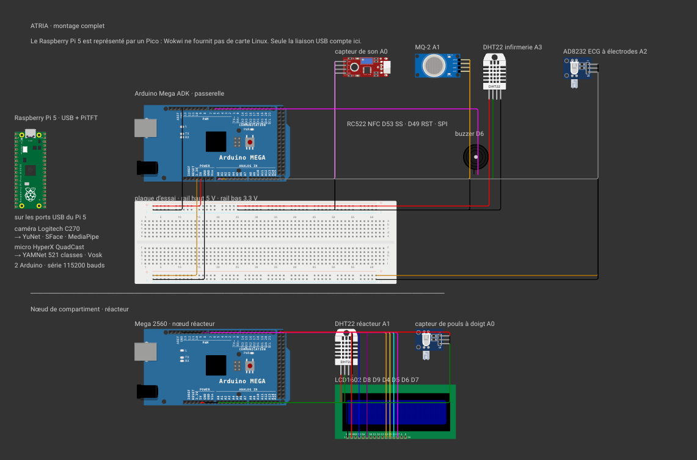

# Schéma de montage

Tout le câblage d'ATRIA, en un seul projet [Wokwi](https://wokwi.com). `diagram.json` est
du texte : il se lit dans un éditeur, se compare dans une pull request et se rend
graphiquement en ligne, contrairement à une capture d'écran qu'on ne peut pas mettre à
jour proprement.



## Ouvrir le schéma

Aller sur [wokwi.com/projects/new/arduino-mega](https://wokwi.com/projects/new/arduino-mega),
ouvrir l'onglet `diagram.json`, tout sélectionner et coller le contenu du fichier. Le
schéma apparaît immédiatement. Coller ensuite `sketch.ino` dans l'onglet du même nom et
ajouter les bibliothèques de `libraries.txt` par le gestionnaire.

Dans VS Code, l'extension Wokwi lit directement `wokwi.toml`.

## Le Raspberry Pi est un Pico

Wokwi ne fournit aucune carte Linux, seulement le Pi Pico qui est un microcontrôleur. Le
Pi 5 y figure donc sous la forme d'un Pico, et le schéma le dit en toutes lettres. Ça
reste honnête parce que du point de vue du câblage le Pi n'apporte que deux choses : une
liaison USB vers chaque Arduino, et le connecteur 40 broches entièrement occupé par
l'écran PiTFT.

C'est aussi pour ça qu'aucun capteur ne va sur le Pi. L'overlay de l'écran réserve SPI0 et
recouvre le connecteur : tout passe par les Arduino.

## Ce que le schéma contient

Deux cartes, séparées par un trait dans le canevas.

**La passerelle**, un Mega ADK, porte les badges, le buzzer, le son, le gaz et
l'atmosphère de l'infirmerie. Les alimentations passent par les rails de la plaque
d'essai, les signaux vont directement sur les broches.

| Broche | Composant | Tension | Ce qu'elle mesure |
|---|---|---|---|
| `A0` | Capteur de son | 5 V | niveau sonore du compartiment |
| `A1` | MQ-2 | 5 V | fumée et gaz combustibles, seuil de combustion |
| `A2` | AD8232 `OUTPUT` | 3,3 V | ECG à électrodes |
| `A3` | DHT22 infirmerie | 5 V | température et humidité |
| `D6` | Buzzer actif | 5 V | acquittement de badge |
| `D49` | RC522 `RST` | 3,3 V | remise à zéro du lecteur |
| `D50` `D51` `D52` | SPI matériel `MISO` `MOSI` `SCK` | 3,3 V | imposé par le matériel |
| `D53` | RC522 `SDA` / `SS` | 3,3 V | sélection du lecteur de badges |

La caméra et le micro ne passent pas par l'Arduino : ils sont branchés en USB sur le Pi,
qui exécute lui-même les modèles de vision et d'écoute.

**Le nœud de compartiment**, un Mega 2560 avec son afficheur, mesure le réacteur.

| Broche | Composant | Tension |
|---|---|---|
| `A0` | Capteur de pouls à doigt | 5 V |
| `A1` | DHT22 réacteur `DATA` | 5 V |
| `D8` `D9` | LCD `RS` et `E` | 5 V |
| `D4` `D5` `D6` `D7` | LCD `D4`..`D7` | 5 V |

Son firmware est dans [`../../firmware/atria_noeud/`](../../firmware/atria_noeud/). Il
annonce une ligne par seconde :

```
READY noeud=<compartiment>
AMBIANCE <compartiment> <tempX10> <humX10>
```

Côté Pi, `pi/atria/noeud.py` scrute `/dev/serial/by-id` toutes les quinze secondes et
ouvre toute carte qui n'est pas la passerelle. Rien à configurer : brancher le câble
suffit, la carte annonce elle-même son compartiment.

## Deux substitutions

Hormis le Pi, tous les composants sont les vrais : Wokwi fournit le RC522, le capteur de
son, le MQ-2, les DHT22 et le LCD. Les deux capteurs cardiaques, l'AD8232 à électrodes de
la passerelle et le capteur de pouls à doigt du nœud, sont représentés par la même pièce
faute d'équivalent exact dans la bibliothèque.

## Deux règles de câblage

**Alimentation.** Le RC522 et l'AD8232 sont en 3,3 V, le capteur de son, le MQ-2 et les
DHT22 en 5 V. D'où les deux rails séparés sur la plaque. Ne jamais faire partager la même
rangée à un composant 3,3 V et à un composant 5 V : c'est ce qui a empêché le RC522 de
répondre pendant une bonne partie du montage.

**Isolation.** Aucune liaison directe entre les broches d'un Arduino et le GPIO du Pi. Les
Arduino sont en 5 V, le GPIO du Pi en 3,3 V. Tout passe par l'USB, et chaque carte est
adressée par son chemin `/dev/serial/by-id` plutôt que par `/dev/ttyACM0` : avec deux
Arduino branchés, l'ordre d'énumération change d'un démarrage à l'autre et la passerelle
se retrouverait à parler au nœud.

## Simuler

`sketch.ino` est le firmware de la passerelle. Le RC522 n'étant pas simulable, présenter
un badge se fait en tapant `BADGE <uid>` dans le moniteur série.

Cliquer sur un DHT22 pendant la simulation ouvre un curseur de température et d'humidité,
et cliquer sur le MQ-2 fait monter la concentration de gaz. C'est de quoi tester le seuil
d'alerte incendie sans allumer quoi que ce soit, ce qui tombe bien puisque le MQ-2 n'a
jamais été testé au gaz.

## Mettre à jour

Ajouter un composant, c'est une entrée dans `parts` et ses liaisons dans `connections`.
Une liaison s'écrit `[source, cible, couleur, trajet]`, les deux premiers champs sous la
forme `identifiant:broche`. Les trous de la plaque s'adressent `bb:tp.<colonne>` pour le
rail positif haut, `bb:tn` pour le négatif haut, `bb:bp` et `bb:bn` pour ceux du bas.

Reporter ensuite dans les tableaux ci-dessus et dans
[`../../docs/materiel.md`](../../docs/materiel.md). La vue système, avec le Pi, son écran
et la circulation des données, est dans [`../../docs/montage.md`](../../docs/montage.md).
